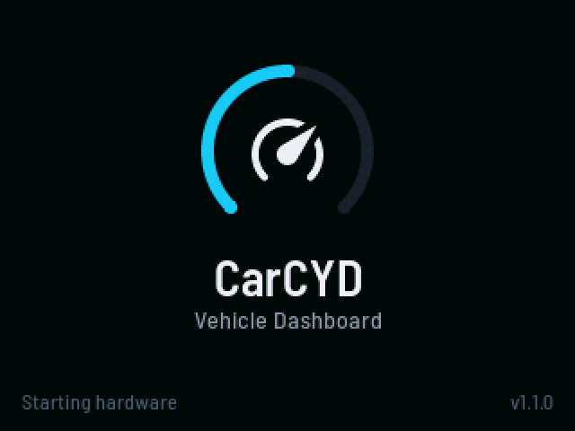
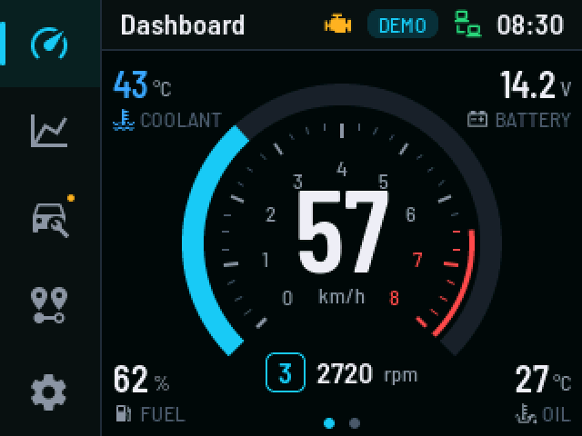
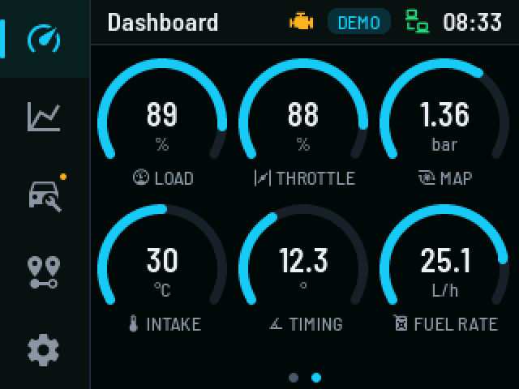
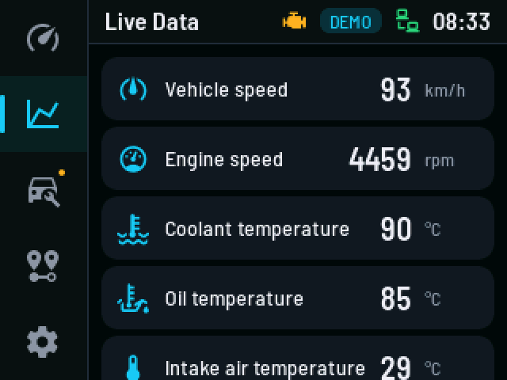
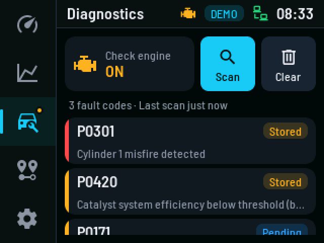
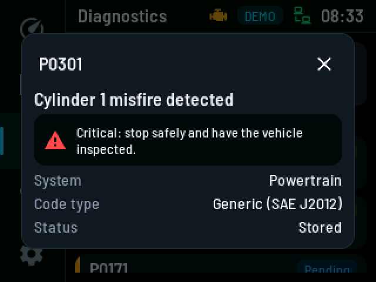
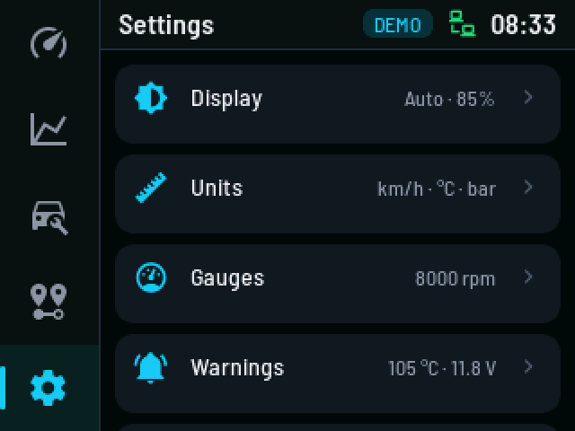
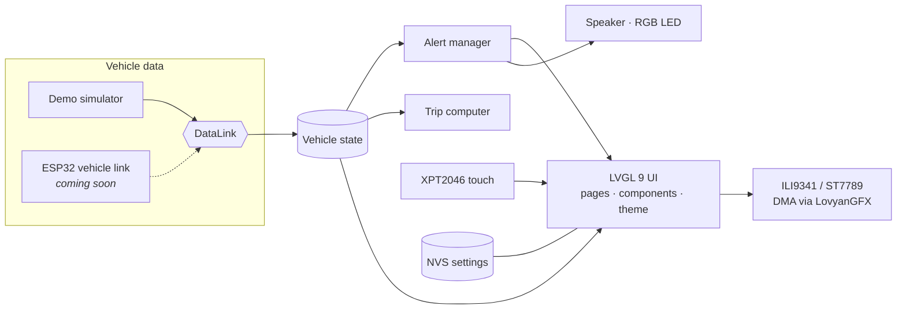

<a id="readme-top"></a>

<div align="center">



# CarCYD — ESP32 Car Dashboard for the Cheap Yellow Display

**Turn a ~$15 ESP32-2432S028R "Cheap Yellow Display" into a digital gauge cluster and OBD-II diagnostic screen.**<br>
Open-source firmware built with LVGL 9 and the Arduino IDE: tachometer and speedometer, live engine data with charts, a fault code reader, a trip computer and driver alerts. A built-in demo mode drives a simulated car, so everything works the minute you flash it.

<p>
  <a href="https://github.com/muki01/Car-Dashboard-ESP32-CYD/stargazers"></a>
  <a href="https://github.com/muki01/Car-Dashboard-ESP32-CYD/network/members"></a>
  <a href="https://github.com/muki01/Car-Dashboard-ESP32-CYD/issues"></a>
  <a href="LICENSE"></a>
  <a href="https://github.com/muki01/Car-Dashboard-ESP32-CYD/releases/latest"></a>
  <a href="https://github.com/muki01/Car-Dashboard-ESP32-CYD/actions/workflows/build.yml"></a>
</p>

<p>
  <a href="#-what-you-need"></a>
  <a href="#-quick-start"></a>
  <a href="#-what-you-need"></a>
  <a href="#-architecture"></a>
</p>

**[Demo](#-demo)** · **[Features](#-features)** · **[Screenshots](#-screenshots)** · **[Quick Start](#-quick-start)** · **[Architecture](#-architecture)** · **[Roadmap](#-roadmap)** · **[FAQ](#-faq)** · **[Custom Development](#-custom-development)**

</div>

---

## 📌 Overview

**CarCYD** is an open-source **car dashboard firmware** for the **ESP32 Cheap Yellow Display** (CYD, **ESP32-2432S028R**, 2.8" 320×240 touchscreen). It is built with **LVGL 9** and the **Arduino IDE** and turns the board into a digital **gauge cluster** with a tachometer and speedometer, **live OBD-II data** with charts, a **DTC fault code reader** with one-tap clear, a **trip computer**, smart **driver alerts** and more than 25 settings.

It was designed and engineered like a commercial automotive HMI: clean layered architecture, DMA display driver, persistent settings, touch calibration, auto-brightness, localization and a PC simulator.

> [!NOTE]
> **No car? No problem.** A built-in demo mode simulates a car being driven — cold start, gear shifts, warnings and stored fault codes — so everything works the minute you flash it. The connection to a real vehicle is the next step on the [roadmap](#-roadmap); the [FAQ](#-faq) explains why the board cannot read the OBD-II port on its own.

## 🎬 Demo

<div align="center">



<sub>Real firmware UI (not a mock-up), recorded with the included PC simulator. The circle shows where the screen is touched.</sub>

</div>

## ✨ Features

| | |
| :-- | :-- |
| 🏎️ **Gauge cluster** | 270° tachometer ring with red zone, digital speed, gear indicator, flashing **shift light**, start-up needle sweep |
| 📊 **Two dashboard views** | Cluster with four corner values, or six mini gauges — swipe to switch, **long-press to customize** any value |
| 📈 **Live data** | 18 engine signals with severity colors; tap for a real-time **chart with min / avg / max** |
| 🔧 **OBD-II diagnostics** | Check-engine (MIL) status, **read & clear DTCs**, stored / pending / permanent codes, descriptions for 92 common codes, severity and advice |
| 🚨 **Driver alerts** | Coolant, oil, battery low/high, fuel, speed limit, check engine, link lost — debounced, with hysteresis, on-screen banner, sound and LED |
| 🧭 **Trip computer** | Distance, drive time, average / max speed, fuel used, average consumption and a **0-100 km/h (0-60 mph) timer** |
| ⚙️ **25+ settings** | Auto brightness, day/night levels, 180° rotation, 5 accent colors, units (km/h·mph, °C·°F, kPa·bar·psi), gauge range, warning thresholds, sounds |
| 🌍 **Localization** | English and Turkish UI with a custom font set (Barlow + Material Design Icons) |
| 🧪 **Developer tooling** | PC simulator that renders every screen, font/icon generator, CI builds for all board variants |

### Uses every part of the Cheap Yellow Display

| CYD hardware | What CarCYD does with it |
| :-- | :-- |
| ILI9341 / ST7789 2.8" TFT | LVGL 9 with two DMA buffers and zero-copy `RGB565_SWAPPED` transfers |
| XPT2046 resistive touch | Software SPI (keeps VSPI free for the SD card), debouncing, 3+1-point calibration |
| Backlight PWM | Perceptual brightness curve with smooth fades |
| LDR light sensor | Automatic day / night brightness |
| Speaker output | Touch clicks, confirmation tones, warning and critical alarm melodies |
| RGB LED | Shift light, warning status, "waiting for vehicle" indicator |
| BOOT button | Acknowledge alerts, next page, back to dashboard, calibration at power-up |
| NVS flash | Settings, calibration and trip data — versioned and CRC protected |

## 📸 Screenshots

<table>
  <tr>
    <td align="center"><br><sub><b>Gauge cluster</b></sub></td>
    <td align="center"><br><sub><b>Shift light</b></sub></td>
    <td align="center"><br><sub><b>Engine gauges</b></sub></td>
  </tr>
  <tr>
    <td align="center"><br><sub><b>Live data</b></sub></td>
    <td align="center"><br><sub><b>Real-time chart</b></sub></td>
    <td align="center"><br><sub><b>Fault codes (DTC)</b></sub></td>
  </tr>
  <tr>
    <td align="center"><br><sub><b>Code details</b></sub></td>
    <td align="center"><br><sub><b>Driver alerts</b></sub></td>
    <td align="center"><br><sub><b>Trip computer</b></sub></td>
  </tr>
  <tr>
    <td align="center"><br><sub><b>Settings</b></sub></td>
    <td align="center"><br><sub><b>Gauge setup</b></sub></td>
    <td align="center"><br><sub><b>Accent colors</b></sub></td>
  </tr>
</table>

<div align="center">

All 29 screens: [English](images/screenshots/en) · [Turkish UI](images/screenshots/tr) · [one-page overview](images/screenshots/overview_en.png)

</div>

## 🧰 What You Need

| Part | Notes |
| :-- | :-- |
| **ESP32-2432S028R** "Cheap Yellow Display" | 1-USB (ILI9341) or 2-USB "CYD2USB" (ILI9341 / ST7789) version |
| USB cable | Micro-USB or USB-C depending on the board |
| Small 8 Ω speaker *(optional)* | JST 1.25 mm "SPEAK" connector for alert sounds |
| 12 V → 5 V automotive converter *(in the car)* | Load-dump protected; see the [hardware notes](docs/hardware.md#in-car-installation) |
| Vehicle interface *(coming)* | A second ESP32 with a CAN / OBD-II front end — see the [roadmap](#-roadmap) |

## 🚀 Quick Start

### Flash a prebuilt firmware (no IDE needed)

Every [release](https://github.com/muki01/Car-Dashboard-ESP32-CYD/releases/latest) ships ready-to-flash images:

| Your board | Release file |
| :-- | :-- |
| one micro-USB port | `CarCYD-<version>-CYD-1USB-ILI9341.bin` |
| micro-USB **and** USB-C | `CarCYD-<version>-CYD2USB-ILI9341.bin` |
| 2-USB board with ST7789 | `CarCYD-<version>-CYD2USB-ST7789.bin` |

1. Open the **[ESP web flasher](https://espressif.github.io/esptool-js/)** in Chrome or Edge, click *Connect* and choose the board's serial port (Windows may need the CH340 USB driver).
2. Set the flash address to **`0x0`**, select the `.bin` file and click *Program*.
3. Press the board's reset button — the touch calibration starts.

Command line alternative: `pip install esptool`, then `esptool --chip esp32 write-flash 0x0 <file>.bin`. The image contains bootloader, partition table and application, so flashing it also resets stored settings.

### Arduino IDE

1. **Board package:** *Boards Manager* → install **esp32 by Espressif Systems** 3.x. If it is not listed, add `https://espressif.github.io/arduino-esp32/package_esp32_index.json` under *File → Preferences → Additional boards manager URLs*.
2. **Libraries:** *Library Manager* → install **lvgl** (9.6 or newer) and **LovyanGFX** (1.2 or newer).
3. **Open** `CarCYD/CarCYD.ino`. `lv_conf.h` ships inside the sketch folder and is found automatically — *no copying into the libraries folder, no editing of library files.*
4. **Select your board variant** in [`CarCYD/src/config/board_config.h`](CarCYD/src/config/board_config.h):

   | Your board | Setting |
   | :-- | :-- |
   | one micro-USB port | `CYD_PANEL_ILI9341` and `CYD_PANEL_INVERT 0` |
   | micro-USB **and** USB-C | `CYD_PANEL_ILI9341_2` and `CYD_PANEL_INVERT 1` *(repository default)* |
   | 2-USB board with ST7789 | `CYD_PANEL_ST7789` and `CYD_PANEL_INVERT 0` |

5. **Tools menu:** Board *ESP32 Dev Module*, Partition Scheme *Default 4MB with spiffs*, PSRAM *Disabled*.
6. **Upload.** On the first start a short touch calibration runs (tap four targets). Done.

### arduino-cli

```bash
arduino-cli core install esp32:esp32 --additional-urls https://espressif.github.io/arduino-esp32/package_esp32_index.json
arduino-cli lib install "lvgl@9.6.0" "LovyanGFX"
arduino-cli compile --fqbn esp32:esp32:esp32 CarCYD
arduino-cli upload  --fqbn esp32:esp32:esp32 -p COM5 CarCYD   # your serial port
```

The firmware uses about **770 KB flash** and **26 KB static RAM** and builds with zero warnings.

## 🎮 Using It

- **Navigation rail** (left): Dashboard · Live data · Diagnostics · Trip · Settings.
- **Dashboard:** swipe left/right (or tap the dots) to switch views; **long-press** a value to replace it.
- **Alerts:** tap the banner to acknowledge. Critical alerts repeat their sound until acknowledged.
- **BOOT button:** short press = acknowledge alert / next page · long press = back to the dashboard · hold during power-up = touch calibration.
- **Data source:** *Settings → Connection* switches between **Demo** and the **ESP32 link**.

## 🧩 Architecture



- **`core/`** — portable business logic with no Arduino dependency: vehicle state, signal limits, alerts, trip computer, DTC database, settings, units, localization.
- **`hal/`** — drivers for the display, touch, backlight, light sensor, speaker, RGB LED, button and NVS.
- **`ui/`** — LVGL pages and reusable components built on a small design system (`theme.h`).
- **`app/`** — composition root and the cooperative main loop.

Adding the real vehicle connection means implementing **one class** (`core::DataLink`); the UI, alerts and trip computer need no changes. Read more in [docs/architecture.md](docs/architecture.md) and the [UI guidelines](docs/ui-guidelines.md).

<details>
<summary><b>Project structure</b></summary>

<br>

```text
Car-Dashboard-ESP32-CYD/
├── CarCYD/                     Arduino sketch (open CarCYD.ino)
│   ├── CarCYD.ino              Entry point: app::setup() / app::loop()
│   ├── lv_conf.h               LVGL configuration, found automatically
│   └── src/
│       ├── config/             board_config.h (pins, variant) · app_config.h (version, timing)
│       ├── app/                Start-up sequence, main loop, service wiring
│       ├── core/               Platform independent logic (vehicle state, alerts, trip, DTC, i18n ...)
│       ├── hal/                Hardware drivers (LovyanGFX display + touch, PWM, ADC, NVS)
│       └── ui/                 Theme, widgets, components, pages, generated fonts
├── docs/                       Hardware, architecture and UI guidelines
├── images/                     Banner, demo GIF and screenshots
└── tools/
    ├── fonts/                  Font & icon generator (lv_font_conv) and source fonts
    └── simulator/              Headless PC simulator: screenshots, demo GIF, social preview
```

</details>

## 💻 Develop the UI on Your PC

The complete UI runs on the desktop with the same `lv_conf.h`, fonts and code. A scripted tour taps through every screen and writes pixel-exact screenshots — the images in this README are generated this way.

```bash
python tools/simulator/build.py --zig /path/to/zig                   # screenshots -> images/screenshots/en
python tools/simulator/build.py --zig /path/to/zig --demo --banner   # demo GIF + social preview
```

See [tools/simulator](tools/simulator/README.md). Fonts and icons are regenerated with [tools/fonts](tools/fonts/README.md).

## 🚧 Roadmap

- [x] Gauge cluster, live data, diagnostics, trip computer, alerts, settings
- [x] Demo mode, touch calibration, auto brightness, localization, PC simulator
- [ ] **Vehicle link:** second ESP32 with CAN / OBD-II over UART (CN1) or ESP-NOW
- [ ] Freeze-frame data and readiness monitors
- [ ] Data logging to the micro SD card (CSV)
- [ ] OTA updates (the default partition scheme is already OTA ready)
- [ ] PlatformIO project file
- [ ] More languages — contributions welcome!

## ❓ FAQ

<details>
<summary><b>Can the CYD read my car's OBD-II port directly?</b></summary>

<br>

No. The board has no CAN transceiver or K-Line interface. CarCYD is designed to receive vehicle data from a separate interface (for example a second ESP32 with a CAN transceiver) through the `DataLink` abstraction. Until that link exists, the demo mode shows exactly how everything behaves.

</details>

<details>
<summary><b>Which Cheap Yellow Display versions are supported?</b></summary>

<br>

The original ESP32-2432S028R (ILI9341, one micro-USB port) and the two-USB "CYD2USB" versions (ILI9341 with alternative init, or ST7789). Colour inversion, mirroring and touch orientation are handled per variant — see [docs/hardware.md](docs/hardware.md).

</details>

<details>
<summary><b>Why LovyanGFX instead of TFT_eSPI?</b></summary>

<br>

LovyanGFX is configured entirely inside the project (no editing of `User_Setup.h` in the library folder), supports DMA, and drives the XPT2046 touch controller over software SPI so the SD card keeps its own bus.

</details>

<details>
<summary><b>Where is lv_conf.h? Do I need to copy it?</b></summary>

<br>

No. It lives in `CarCYD/lv_conf.h`. The ESP32 Arduino core puts the sketch folder on the include path and LVGL finds it with `__has_include`. Just make sure there is no *other* `lv_conf.h` in your Arduino `libraries` folder.

</details>

<details>
<summary><b>The picture is mirrored, inverted or upside down.</b></summary>

<br>

Select the matching `CYD_PANEL` / `CYD_PANEL_INVERT` in `board_config.h`. Upside down: *Settings → Display → Rotate screen 180°*. The full troubleshooting table is in [docs/hardware.md](docs/hardware.md#orientation-and-mirroring).

</details>

## 🙏 Acknowledgements

[LVGL](https://lvgl.io) · [LovyanGFX](https://github.com/lovyan03/LovyanGFX) · [Arduino-ESP32](https://github.com/espressif/arduino-esp32) · [ESP32 Cheap Yellow Display community](https://github.com/witnessmenow/ESP32-Cheap-Yellow-Display) · [Barlow](https://github.com/jpt/barlow) typeface · [Material Design Icons](https://pictogrammers.com/library/mdi/) · [lv_font_conv](https://github.com/lvgl/lv_font_conv)

Third-party licenses are listed in [THIRD_PARTY_NOTICES.md](THIRD_PARTY_NOTICES.md).

## 🤝 Contributing

Contributions, bug reports and feature ideas are welcome — new languages, gauge styles, board variants and the vehicle link in particular. Please read the **[Contributing Guide](CONTRIBUTING.md)** and the **[Code of Conduct](CODE_OF_CONDUCT.md)** first. For UI changes, attach simulator screenshots to your pull request.

Questions and build photos are welcome in [Discussions](https://github.com/muki01/Car-Dashboard-ESP32-CYD/discussions). Security problems go to the **[Security Policy](SECURITY.md)**, not to a public issue.

## 🔗 Related Projects

This firmware is part of a family of open-source automotive projects.

<table>
  <tr>
    <th colspan="3" align="left">Firmware — flash it and use it</th>
  </tr>
  <tr>
    <td width="30%"><b>ESP32 CYD Car Dashboard</b><br><sub>you are here</sub></td>
    <td>Digital gauge cluster and OBD-II display for the ESP32 Cheap Yellow Display, built with LVGL 9.</td>
    <td width="118" align="center"><a href="https://github.com/muki01/Car-Dashboard-ESP32-CYD/stargazers"></a></td>
  </tr>
  <tr>
    <td width="30%"><a href="https://github.com/muki01/BMW_IBus_KBus"><b>BMW I-Bus / K-Bus Firmware</b></a></td>
    <td>Phone control and key-fob light functions for the BMW E46, on the ESP32 and Arduino.</td>
    <td width="118" align="center"><a href="https://github.com/muki01/BMW_IBus_KBus/stargazers"></a></td>
  </tr>
  <tr>
    <td width="30%"><a href="https://github.com/muki01/OBD2_K-line_Reader"><b>OBD2 K-Line Reader</b></a></td>
    <td>Scan tool for K-Line cars (ISO 9141-2, KWP2000) with a web dashboard, for the ESP32, ESP8266 and Arduino.</td>
    <td width="118" align="center"><a href="https://github.com/muki01/OBD2_K-line_Reader/stargazers"></a></td>
  </tr>
  <tr>
    <td width="30%"><a href="https://github.com/muki01/OBD2_CAN_Bus_Reader"><b>OBD2 CAN Bus Reader</b></a></td>
    <td>Scan tool for CAN bus cars (ISO 15765-4) with the same web dashboard, for the ESP32.</td>
    <td width="118" align="center"><a href="https://github.com/muki01/OBD2_CAN_Bus_Reader/stargazers"></a></td>
  </tr>
  <tr>
    <td width="30%"><a href="https://github.com/muki01/VAG_KW1281"><b>VAG KW1281</b></a></td>
    <td>KW1281 diagnostics for VW, Audi, Škoda and SEAT: ECU information, measuring groups and fault codes.</td>
    <td width="118" align="center"><a href="https://github.com/muki01/VAG_KW1281/stargazers"></a></td>
  </tr>
  <tr>
    <th colspan="3" align="left">Libraries — build your own firmware</th>
  </tr>
  <tr>
    <td width="30%"><a href="https://github.com/muki01/BMW_IBus_KBus_Library"><b>BMW IBus KBus Library</b></a></td>
    <td>Receives, checks and sends BMW I-Bus and K-Bus messages; the library behind the BMW firmware.</td>
    <td width="118" align="center"><a href="https://github.com/muki01/BMW_IBus_KBus_Library/stargazers"></a></td>
  </tr>
  <tr>
    <td width="30%"><a href="https://github.com/muki01/OBD2_KLine_Library"><b>OBD2 K-Line Library</b></a></td>
    <td>K-Line diagnostics behind one API: ISO 9141-2, KWP2000, KW1281, DS2 and KW82.</td>
    <td width="118" align="center"><a href="https://github.com/muki01/OBD2_KLine_Library/stargazers"></a></td>
  </tr>
  <tr>
    <td width="30%"><a href="https://github.com/muki01/OBD2_CAN_Bus_Library"><b>OBD2 CAN Bus Library</b></a></td>
    <td>OBD-II diagnostics over ISO 15765-4 with the ESP32's built-in CAN controller.</td>
    <td width="118" align="center"><a href="https://github.com/muki01/OBD2_CAN_Bus_Library/stargazers"></a></td>
  </tr>
  <tr>
    <th colspan="3" align="left">Interface and tools</th>
  </tr>
  <tr>
    <td width="30%"><a href="https://github.com/muki01/OBD2-Diagnostic-UI"><b>OBD2 Diagnostic UI</b></a></td>
    <td>The web dashboard used by the two OBD2 readers.</td>
    <td width="118" align="center"><a href="https://github.com/muki01/OBD2-Diagnostic-UI/stargazers"></a></td>
  </tr>
  <tr>
    <td width="30%"><a href="https://github.com/muki01/Bosch_EDC15_EEPROM_Tool"><b>Bosch EDC15 EEPROM Tool</b></a></td>
    <td>Immobilizer, mileage and login code editor for the 24C04 EEPROM of Bosch EDC15 ECUs.</td>
    <td width="118" align="center"><a href="https://github.com/muki01/Bosch_EDC15_EEPROM_Tool/stargazers"></a></td>
  </tr>
</table>

## 💼 Custom Development

I design automotive diagnostic tools, firmware and hardware professionally. Whether you need a complete product or only the communication layer, I can help.

| Service | Details |
| :-- | :-- |
| **Protocol implementation** | BMW I/K-Bus, K-Line (ISO 9141-2 / KWP2000), CAN / UDS, VAG KW1281 and other manufacturer-specific protocols |
| **ECU communication & reverse engineering** | Bus sniffing, packet decoding, module control, undocumented ECUs and buses |
| **ECU security access** | Seed-key algorithms and unlock routines for KWP2000 / UDS |
| **Embedded firmware** | Arduino, ESP32, ESP8266, STM32, Raspberry Pi Pico |
| **Displays & dashboards** | LVGL touch interfaces and gauge clusters for the ESP32 and other microcontrollers |
| **Custom hardware** | Diagnostic dongles, shields and PCBs designed to your requirements |
| **Companion apps** | Android, iOS and web apps to visualise, log and control your device |

Have a project in mind? Reach out through the [Contact](#-contact) section below.

## 📬 Contact

For custom development, collaboration, sponsorship or ready-made devices:

| Channel | Address |
| :-- | :-- |
| 📧 **Email** | [muksin.muksin04@gmail.com](mailto:muksin.muksin04@gmail.com) |
| 💼 **LinkedIn** | [linkedin.com/in/muksin-muksin](https://www.linkedin.com/in/muksin-muksin/) |
| 🐙 **GitHub** | [@muki01](https://github.com/muki01) |

## ☕ Support the Project

If this project helped you, consider supporting its development:

<p>
  <a href="https://www.buymeacoffee.com/muki01"></a>
  <a href="https://www.paypal.com/donate/?hosted_button_id=SAAH5GHAH6T72"></a>
  <a href="https://github.com/sponsors/muki01"></a>
</p>

## 📈 Star History

<a href="https://star-history.com/#muki01/Car-Dashboard-ESP32-CYD&Date">
  <picture>
    <source media="(prefers-color-scheme: dark)" srcset="https://api.star-history.com/svg?repos=muki01/Car-Dashboard-ESP32-CYD&type=Date&theme=dark">
    
  </picture>
</a>

## ⚠️ Disclaimer

> [!WARNING]
> This is a hobby and development project, not a certified instrument. Do not rely on it as your only source of speed, warning or engine information, mount it where it does not block your view, and never operate the touchscreen while driving. The author accepts no responsibility for damage or malfunction.

## 📄 License

Released under the **[GNU General Public License v3.0](LICENSE)**.

- You are free to use, study, modify and share this firmware.
- If you distribute it — on its own or as part of a product or firmware — you must make the complete source available under the same license.

**Closed-source or commercial product?** A separate commercial license is available. Get in touch through the [Contact](#-contact) section.

Third-party components keep their own licenses, see [THIRD_PARTY_NOTICES.md](THIRD_PARTY_NOTICES.md).

Copyright © 2026 Muksin Muksin.

---

<div align="center">

Created by [**Muki**](https://github.com/muki01) · If this project helped you, please give it a ⭐

<sub>ESP32 car dashboard · Cheap Yellow Display · CYD · ESP32-2432S028R · LVGL 9 · OBD2 display · OBD-II gauge · digital gauge cluster · tachometer · speedometer · DTC reader · trip computer · Arduino IDE · LovyanGFX</sub>

**[⬆ Back to top](#readme-top)**

</div>
