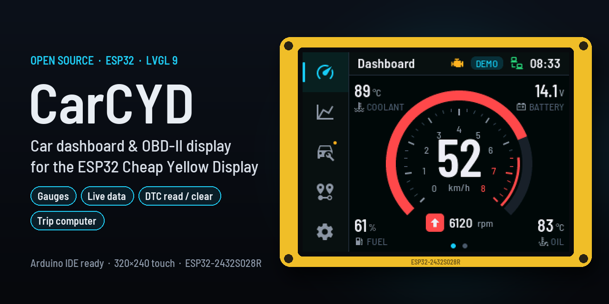
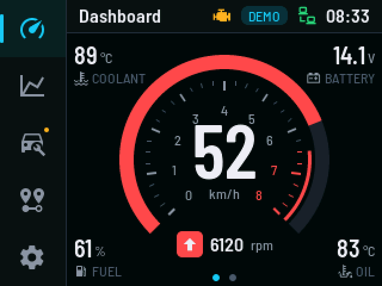
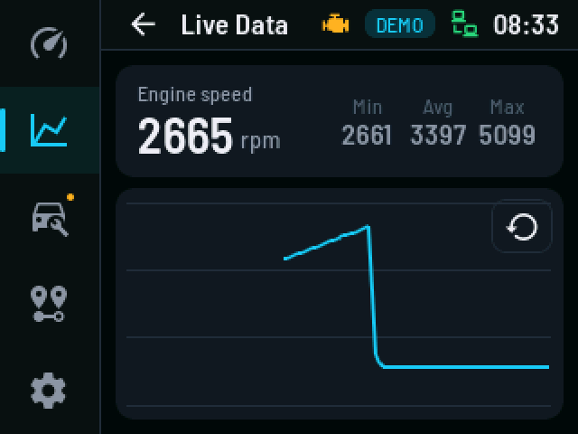
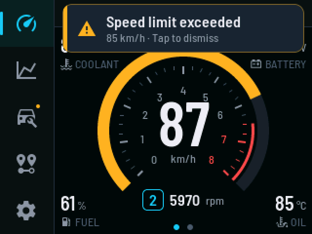
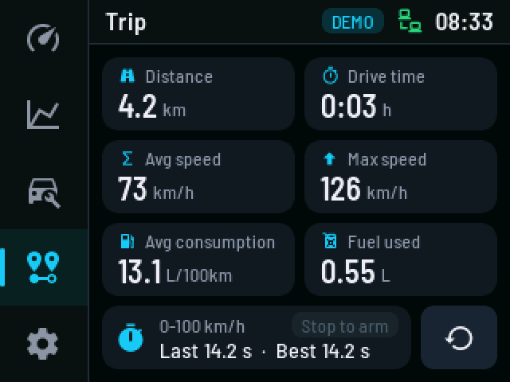
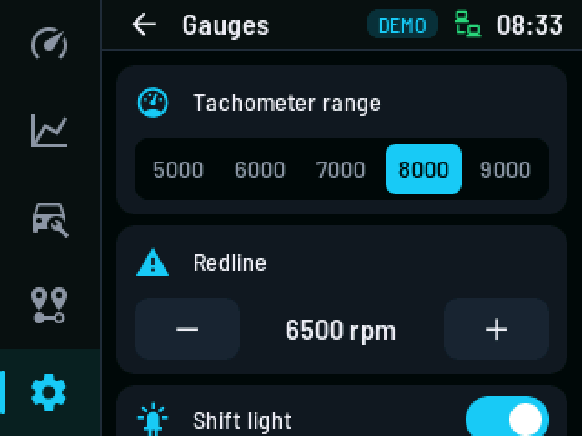
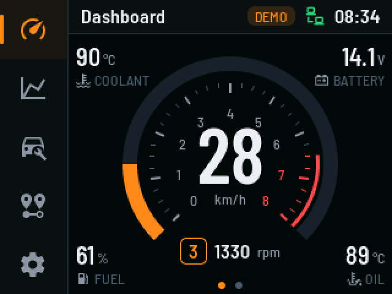
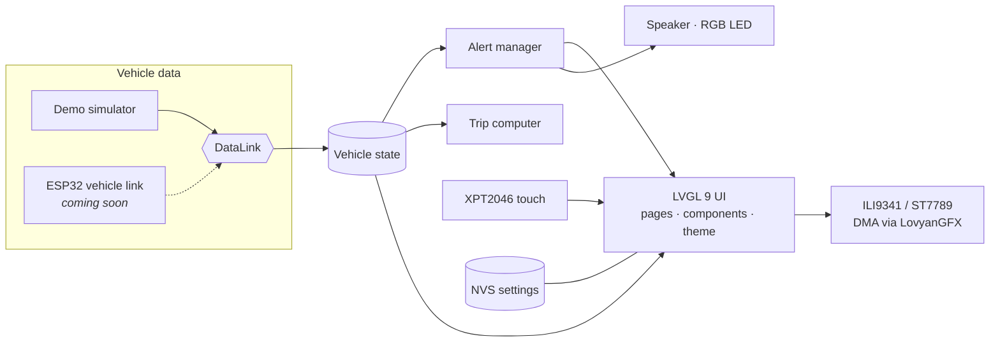

<p align="center">
  
</p>

<h1 align="center">CarCYD — ESP32 Car Dashboard for the Cheap Yellow Display</h1>

<p align="center">
  <b>Turn a ~$15 ESP32-2432S028R “Cheap Yellow Display” (CYD) into a product-grade digital gauge cluster<br>
  and OBD-II diagnostic screen — LVGL 9, Arduino IDE, touch UI, zero library hacking.</b>
</p>

<p align="center">
  <a href="https://github.com/muki01/Car-Dashboard-ESP32-CYD/actions/workflows/build.yml"></a>
  <a href="https://github.com/muki01/Car-Dashboard-ESP32-CYD/releases/latest"></a>
  <a href="LICENSE"></a>
  
  
  
  
  
</p>

<p align="center">
  <a href="#-demo">Demo</a> •
  <a href="#-features">Features</a> •
  <a href="#-screenshots">Screenshots</a> •
  <a href="#-quick-start">Quick start</a> •
  <a href="#-architecture">Architecture</a> •
  <a href="#-roadmap">Roadmap</a> •
  <a href="#-faq">FAQ</a>
</p>

---

**CarCYD** is an open-source **car dashboard firmware** for the **ESP32 Cheap Yellow Display** (CYD,
**ESP32-2432S028R**, 2.8" 320×240 touchscreen). It is built with **LVGL 9** and the **Arduino IDE** and turns
the board into a digital **gauge cluster** with a tachometer and speedometer, **live OBD-II data** with charts, a
**DTC fault code reader** with one-tap clear, a **trip computer**, smart **driver alerts** and more than 25
settings. It was designed and engineered like a commercial automotive HMI: clean layered architecture,
DMA display driver, persistent settings, touch calibration, auto-brightness, localization and a PC simulator.

> **No car? No problem.** A built-in demo mode simulates a car being driven — cold start, gear shifts,
> warnings and stored fault codes — so everything works the minute you flash it.

## 🎬 Demo

<p align="center">
  
</p>
<p align="center"><sub>Real firmware UI (not a mock-up), recorded with the included PC simulator. The circle shows where the screen is touched.</sub></p>

## ✨ Features

| | |
|---|---|
| 🏎️ **Gauge cluster** | 270° tachometer ring with red zone, digital speed, gear indicator, flashing **shift light**, start-up needle sweep |
| 📊 **Two dashboard views** | Cluster with four corner values, or six mini gauges — swipe to switch, **long-press to customize** any value |
| 📈 **Live data** | 18 engine signals with severity colors; tap for a real-time **chart with min / avg / max** |
| 🔧 **OBD-II diagnostics** | Check-engine (MIL) status, **read & clear DTCs**, stored / pending / permanent codes, descriptions for 92 common codes, severity and advice |
| 🚨 **Driver alerts** | Coolant, oil, battery low/high, fuel, speed limit, check engine, link lost — debounced, with hysteresis, on-screen banner, sound and LED |
| 🧭 **Trip computer** | Distance, drive time, average / max speed, fuel used, average consumption and a **0-100 km/h (0-60 mph) timer** |
| ⚙️ **25+ settings** | Auto brightness, day/night levels, 180° rotation, 5 accent colors, units (km/h·mph, °C·°F, kPa·bar·psi), gauge range, warning thresholds, sounds |
| 🌍 **Localization** | English and Turkish UI with a custom font set (Barlow + Material Design Icons) |
| 🧪 **Developer tooling** | PC simulator that renders every screen, font/icon generator, CI builds for all board variants |

### Uses every part of the Cheap Yellow Display

| CYD hardware | What CarCYD does with it |
|---|---|
| ILI9341 / ST7789 2.8" TFT | LVGL 9 with two DMA buffers and zero-copy `RGB565_SWAPPED` transfers |
| XPT2046 resistive touch | Software SPI (keeps VSPI free for the SD card), debouncing, 3+1-point calibration |
| Backlight PWM | Perceptual brightness curve with smooth fades |
| LDR light sensor | Automatic day / night brightness |
| Speaker output | Touch clicks, confirmation tones, warning and critical alarm melodies |
| RGB LED | Shift light, warning status, "waiting for vehicle" indicator |
| BOOT button | Acknowledge alerts, next page, back to dashboard, calibration at power-up |
| NVS flash | Settings, calibration and trip data — versioned and CRC protected |

## 📸 Screenshots

<table>
  <tr>
    <td align="center"><br><sub><b>Gauge cluster</b></sub></td>
    <td align="center"><br><sub><b>Shift light</b></sub></td>
    <td align="center"><br><sub><b>Engine gauges</b></sub></td>
  </tr>
  <tr>
    <td align="center"><br><sub><b>Live data</b></sub></td>
    <td align="center"><br><sub><b>Real-time chart</b></sub></td>
    <td align="center"><br><sub><b>Fault codes (DTC)</b></sub></td>
  </tr>
  <tr>
    <td align="center"><br><sub><b>Code details</b></sub></td>
    <td align="center"><br><sub><b>Driver alerts</b></sub></td>
    <td align="center"><br><sub><b>Trip computer</b></sub></td>
  </tr>
  <tr>
    <td align="center"><br><sub><b>Settings</b></sub></td>
    <td align="center"><br><sub><b>Gauge setup</b></sub></td>
    <td align="center"><br><sub><b>Accent colors</b></sub></td>
  </tr>
</table>

<p align="center">
  All 29 screens: <a href="docs/screenshots/en">English</a> · <a href="docs/screenshots/tr">Turkish UI</a> ·
  <a href="docs/screenshots/overview_en.png">one-page overview</a>
</p>

## 🧰 What you need

| Part | Notes |
|---|---|
| **ESP32-2432S028R** "Cheap Yellow Display" | 1-USB (ILI9341) or 2-USB "CYD2USB" (ILI9341 / ST7789) version |
| USB cable | Micro-USB or USB-C depending on the board |
| Small 8 Ω speaker *(optional)* | JST 1.25 mm "SPEAK" connector for alert sounds |
| 12 V → 5 V automotive converter *(in the car)* | Load-dump protected; see [hardware notes](docs/hardware.md#in-car-installation) |
| Vehicle interface *(coming)* | A second ESP32 with a CAN / OBD-II front end — see the [roadmap](#-roadmap) |

## 🚀 Quick start

### Flash a prebuilt firmware (no IDE needed)

Every [release](https://github.com/muki01/Car-Dashboard-ESP32-CYD/releases/latest) ships ready-to-flash images:

| Your board | Release file |
|---|---|
| one micro-USB port | `CarCYD-<version>-CYD-1USB-ILI9341.bin` |
| micro-USB **and** USB-C | `CarCYD-<version>-CYD2USB-ILI9341.bin` |
| 2-USB board with ST7789 | `CarCYD-<version>-CYD2USB-ST7789.bin` |

1. Open the **[ESP web flasher](https://espressif.github.io/esptool-js/)** in Chrome or Edge, click
   *Connect* and choose the board's serial port (Windows may need the CH340 USB driver).
2. Set the flash address to **`0x0`**, select the `.bin` file and click *Program*.
3. Press the board's reset button — the touch calibration starts.

Command line alternative: `pip install esptool`, then `esptool --chip esp32 write-flash 0x0 <file>.bin`.
The image contains bootloader, partition table and application, so flashing it also resets stored settings.

### Arduino IDE

1. **Board package:** *Boards Manager* → install **esp32 by Espressif Systems** 3.x.
   If it is not listed, add `https://espressif.github.io/arduino-esp32/package_esp32_index.json`
   under *File → Preferences → Additional boards manager URLs*.
2. **Libraries:** *Library Manager* → install **lvgl** (9.6 or newer) and **LovyanGFX** (1.2 or newer).
3. **Open** `CarCYD/CarCYD.ino`. `lv_conf.h` ships inside the sketch folder and is found automatically —
   *no copying into the libraries folder, no editing of library files.*
4. **Select your board variant** in [`CarCYD/src/config/board_config.h`](CarCYD/src/config/board_config.h):

   | Your board | Setting |
   |---|---|
   | one micro-USB port | `CYD_PANEL_ILI9341` and `CYD_PANEL_INVERT 0` |
   | micro-USB **and** USB-C | `CYD_PANEL_ILI9341_2` and `CYD_PANEL_INVERT 1` *(repository default)* |
   | 2-USB board with ST7789 | `CYD_PANEL_ST7789` and `CYD_PANEL_INVERT 0` |

5. **Tools menu:** Board *ESP32 Dev Module*, Partition Scheme *Default 4MB with spiffs*, PSRAM *Disabled*.
6. **Upload.** On the first start a short touch calibration runs (tap four targets). Done.

### arduino-cli

```bash
arduino-cli core install esp32:esp32 --additional-urls https://espressif.github.io/arduino-esp32/package_esp32_index.json
arduino-cli lib install "lvgl@9.6.0" "LovyanGFX"
arduino-cli compile --fqbn esp32:esp32:esp32 CarCYD
arduino-cli upload  --fqbn esp32:esp32:esp32 -p COM5 CarCYD   # your serial port
```

The firmware uses about **770 KB flash** and **26 KB static RAM** and builds with zero warnings.

## 🕹️ Using it

- **Navigation rail** (left): Dashboard · Live data · Diagnostics · Trip · Settings.
- **Dashboard:** swipe left/right (or tap the dots) to switch views; **long-press** a value to replace it.
- **Alerts:** tap the banner to acknowledge. Critical alerts repeat their sound until acknowledged.
- **BOOT button:** short press = acknowledge alert / next page · long press = back to the dashboard ·
  hold during power-up = touch calibration.
- **Data source:** *Settings → Connection* switches between **Demo** and the **ESP32 link**.

## 🏗️ Architecture



- **`core/`** — portable business logic with no Arduino dependency: vehicle state, signal limits, alerts,
  trip computer, DTC database, settings, units, localization.
- **`hal/`** — drivers for the display, touch, backlight, light sensor, speaker, RGB LED, button and NVS.
- **`ui/`** — LVGL pages and reusable components built on a small design system (`theme.h`).
- **`app/`** — composition root and the cooperative main loop.

Adding the real vehicle connection means implementing **one class** (`core::DataLink`); the UI, alerts and trip
computer need no changes. Read more in [docs/architecture.md](docs/architecture.md) and the
[UI guidelines](docs/ui-guidelines.md).

<details>
<summary><b>Project structure</b></summary>

```
├── CarCYD/                     Arduino sketch (open CarCYD.ino)
│   ├── CarCYD.ino              Entry point: app::setup() / app::loop()
│   ├── lv_conf.h               LVGL configuration, found automatically
│   └── src/
│       ├── config/             board_config.h (pins, variant) · app_config.h (version, timing)
│       ├── app/                Start-up sequence, main loop, service wiring
│       ├── core/               Platform independent logic (vehicle state, alerts, trip, DTC, i18n ...)
│       ├── hal/                Hardware drivers (LovyanGFX display + touch, PWM, ADC, NVS)
│       └── ui/                 Theme, widgets, components, pages, generated fonts
├── docs/                       Hardware, architecture, UI guidelines, screenshots, media
└── tools/
    ├── fonts/                  Font & icon generator (lv_font_conv) and source fonts
    └── simulator/              Headless PC simulator: screenshots, demo GIF, banner
```
</details>

## 🖥️ Develop the UI on your PC

The complete UI runs on the desktop with the same `lv_conf.h`, fonts and code. A scripted tour taps through
every screen and writes pixel-exact screenshots — the images in this README are generated this way.

```bash
python tools/simulator/build.py --zig /path/to/zig        # screenshots -> docs/screenshots/en
python tools/simulator/build.py --zig /path/to/zig --demo --banner   # demo GIF + banner
```

See [tools/simulator](tools/simulator/README.md). Fonts and icons are regenerated with
[tools/fonts](tools/fonts/README.md).

## 🗺️ Roadmap

- [x] Gauge cluster, live data, diagnostics, trip computer, alerts, settings
- [x] Demo mode, touch calibration, auto brightness, localization, PC simulator
- [ ] **Vehicle link:** second ESP32 with CAN / OBD-II over UART (CN1) or ESP-NOW
- [ ] Freeze-frame data and readiness monitors
- [ ] Data logging to the micro SD card (CSV)
- [ ] OTA updates (the default partition scheme is already OTA ready)
- [ ] PlatformIO project file
- [ ] More languages — contributions welcome!

## ❓ FAQ

<details>
<summary><b>Can the CYD read my car's OBD-II port directly?</b></summary>

No. The board has no CAN transceiver or K-Line interface. CarCYD is designed to receive vehicle data from a
separate interface (for example a second ESP32 with a CAN transceiver) through the `DataLink` abstraction.
Until that link exists, the demo mode shows exactly how everything behaves.
</details>

<details>
<summary><b>Which Cheap Yellow Display versions are supported?</b></summary>

The original ESP32-2432S028R (ILI9341, one micro-USB port) and the two-USB "CYD2USB" versions
(ILI9341 with alternative init, or ST7789). Colour inversion, mirroring and touch orientation are handled per
variant — see [docs/hardware.md](docs/hardware.md).
</details>

<details>
<summary><b>Why LovyanGFX instead of TFT_eSPI?</b></summary>

LovyanGFX is configured entirely inside the project (no editing of `User_Setup.h` in the library folder),
supports DMA, and drives the XPT2046 touch controller over software SPI so the SD card keeps its own bus.
</details>

<details>
<summary><b>Where is lv_conf.h? Do I need to copy it?</b></summary>

No. It lives in `CarCYD/lv_conf.h`. The ESP32 Arduino core puts the sketch folder on the include path and LVGL
finds it with `__has_include`. Just make sure there is no *other* `lv_conf.h` in your Arduino `libraries` folder.
</details>

<details>
<summary><b>The picture is mirrored, inverted or upside down.</b></summary>

Select the matching `CYD_PANEL` / `CYD_PANEL_INVERT` in `board_config.h`. Upside down: *Settings → Display →
Rotate screen 180°*. The full troubleshooting table is in [docs/hardware.md](docs/hardware.md#orientation-and-mirroring).
</details>

## 🤝 Contributing

Contributions, bug reports and feature ideas are very welcome — new languages, gauge styles, board variants
and the vehicle link in particular. Please read [CONTRIBUTING.md](CONTRIBUTING.md) and the
[Code of Conduct](CODE_OF_CONDUCT.md). For UI changes, attach simulator screenshots to your pull request.
Questions and build photos are welcome in [Discussions](https://github.com/muki01/Car-Dashboard-ESP32-CYD/discussions).

## 🙏 Acknowledgements

[LVGL](https://lvgl.io) · [LovyanGFX](https://github.com/lovyan03/LovyanGFX) ·
[Arduino-ESP32](https://github.com/espressif/arduino-esp32) ·
[ESP32 Cheap Yellow Display community](https://github.com/witnessmenow/ESP32-Cheap-Yellow-Display) ·
[Barlow](https://github.com/jpt/barlow) typeface · [Material Design Icons](https://pictogrammers.com/library/mdi/) ·
[lv_font_conv](https://github.com/lvgl/lv_font_conv). Third-party licenses: [THIRD_PARTY_NOTICES.md](THIRD_PARTY_NOTICES.md).

## 📄 License

Released under the [MIT License](LICENSE).

<p align="center">
  <b>If CarCYD is useful to you, please ⭐ star the repository — it helps others find it.</b>
</p>

<!-- Keywords: ESP32 car dashboard, Cheap Yellow Display, CYD, ESP32-2432S028R, LVGL 9, OBD2 display, OBD-II gauge,
digital gauge cluster, tachometer, speedometer, DTC reader, fault code reader, trip computer, automotive HMI,
Arduino IDE, LovyanGFX, ILI9341, ST7789, XPT2046, touchscreen dashboard -->
